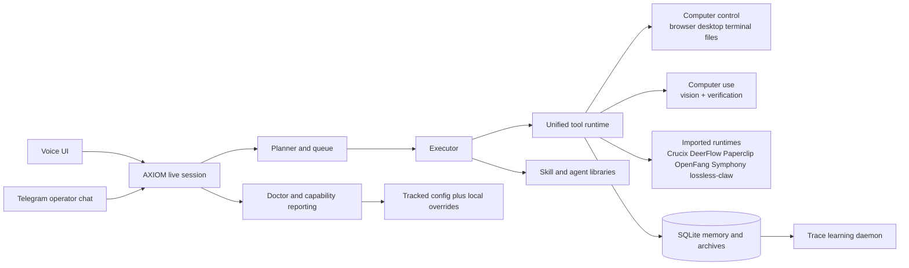
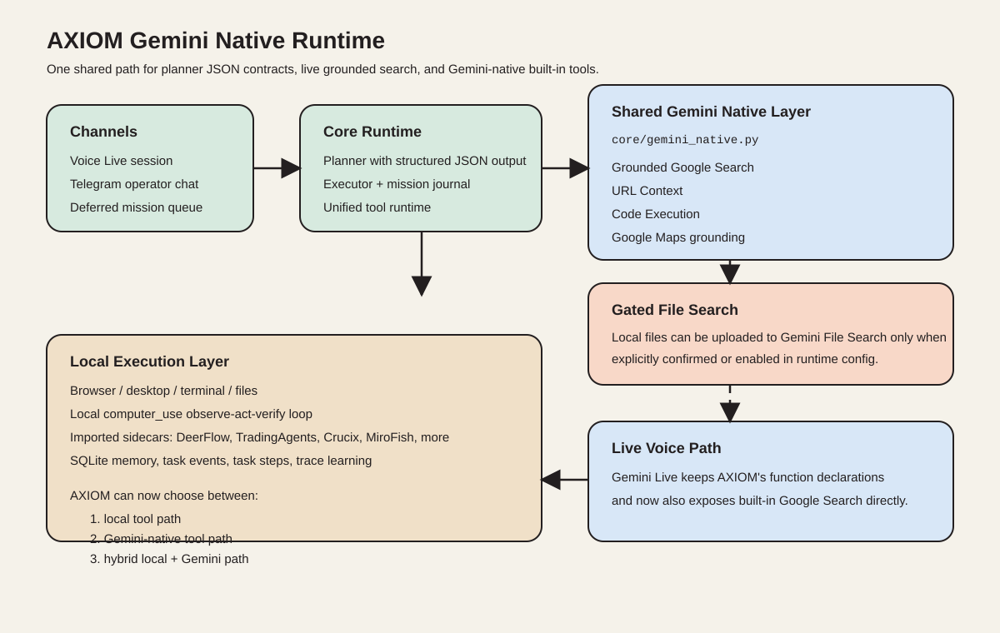
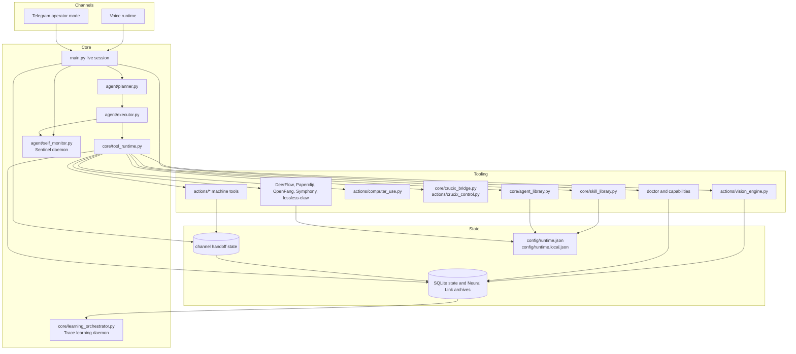
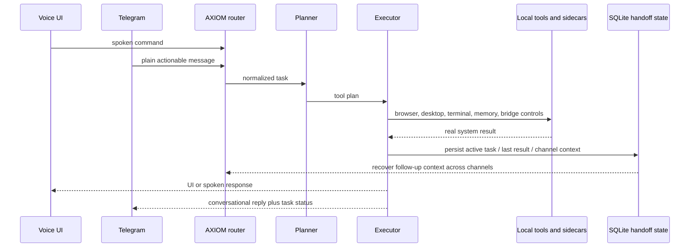
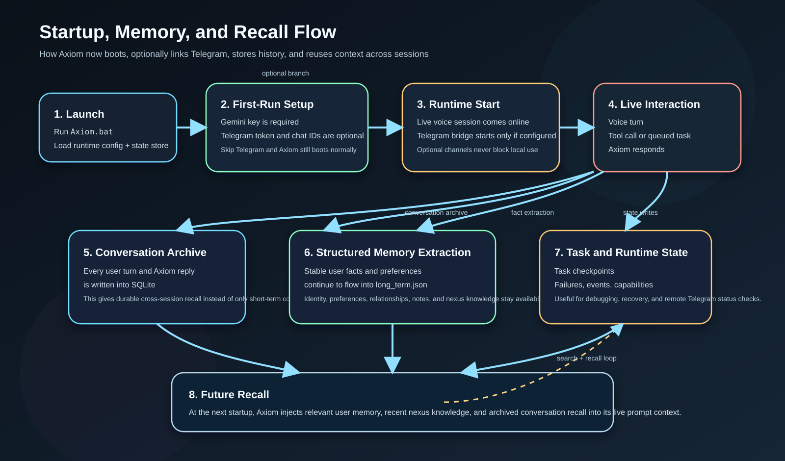
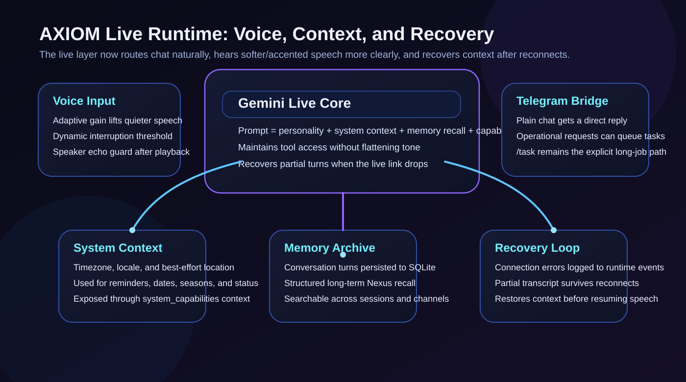
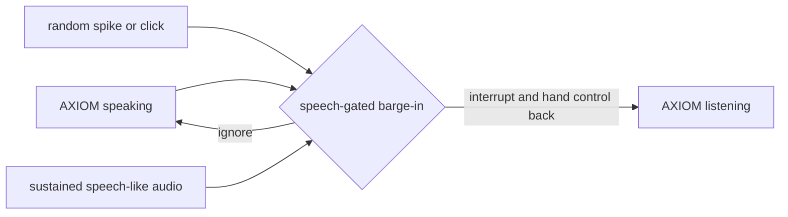
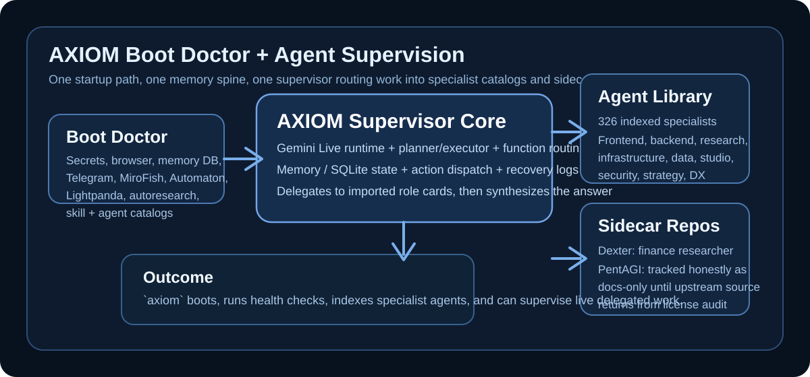

# A.X.I.O.M v4.4
### Windows-first operator with real execution, shared voice and Telegram control, unified tool runtime, trace learning, desktop vision/computer use, Crucix intelligence, persistent Neural Link memory, Sentinel self-monitoring, and imported specialist runtimes

<p align="center">
  
</p>

<p align="center">
  <b>One local runtime, one command, real tool execution.</b><br>
  Gemini Live · Unified Tool Runtime · Planner / Executor · Browser / Desktop / Terminal Control · Desktop Vision / Computer Use · Shared Voice / Telegram State · Shared Operator State · Gmail / Calendar Control · Trace Learning Daemon · Memory / SQLite State · Boot Doctor · Crucix Intelligence · Imported Skill Libraries · Imported Agent Catalogs · Telegram Operator Mode · DeerFlow · Paperclip · OpenFang · Symphony · lossless-claw
</p>

<p align="center">
  
  
  
  
  
  
  
  
</p>

---

## What AXIOM Is

AXIOM is a local operator built around a Gemini Live voice runtime, a task engine, a real machine execution layer, and a persistent memory/state spine.

It is meant to boot as one root process and stay usable even when optional integrations are disabled.

Core ideas:

- `axiom` or `Axiom.bat` should be the normal local entrypoint.
- The live runtime, planner, executor, tools, and memory all belong to one connected system.
- Local state lives in SQLite and long-term memory files instead of vanishing with the last prompt.
- External systems like Telegram, MiroFish, Automaton, PersonaPlex, Lightpanda, DeerFlow, and `autoresearch` are sidecars, not hard requirements for local boot.
- Public repo files stay portable; machine-specific paths and secrets belong in ignored local config files.

## Latest Runtime Upgrades

- Voice and Telegram now share one tool execution backbone instead of separate hardcoded dispatch trees.
- Voice and Telegram now also mirror recent operator task state, so work started in one channel is easier to continue from the other.
- Deferred work now runs through one shared mission journal with persisted phases, plan revisions, step checkpoints, and event history.
- Every tool call is written into SQLite tool traces so AXIOM can mine recurring success and failure patterns.
- A background learning daemon converts recent traces into routing insights stored in durable memory.
- Gemini-native capability calls now go through one shared backend layer in `core/gemini_native.py` instead of being scattered across unrelated modules.
- Voice Live now exposes Gemini's built-in Google Search directly alongside AXIOM's custom function tools.
- `comms_control` can now surface Google Workspace status, check recent Gmail, draft or send human-style email replies, and book Google Calendar events when OAuth is configured.
- Planner and Telegram task-vs-chat routing now use structured JSON generation instead of prompt-for-JSON plus loose parsing.
- AXIOM now has a first-class `gemini_native` tool for grounded Search, URL Context, Code Execution, Maps grounding, and gated File Search.
- `computer_use` is now a higher-level desktop operator that can observe the screen, find targets by description, click or type into them, and verify outcomes.
- Crucix is wired in as a first-class intelligence sidecar for live status, briefs, ideas, and boot management.
- Telegram plain-message routing can now use a local-first classifier path through Ollama when available before escalating to Gemini.

---

## Language Stack

AXIOM is primarily a Python runtime, but the project now intentionally documents the wider language surface used by its imported sidecars and specialist libraries.

| Language / format | Where it shows up | Why it is in the repo story |
|-------------------|-------------------|-----------------------------|
| Python | `main.py`, `agent/`, `actions/`, `core/`, tests, DeerFlow, TradingAgents, `autoresearch` | Primary runtime, planning, execution, bridges, and verification |
| JavaScript / TypeScript | Paperclip, CLI-Anything, Uncodixfy, frontend generation flows, some browser/desktop sidecars | Web UI generation, Node-based runtimes, and imported workflow skills |
| Rust | OpenFang | Native agent-OS path and bundled skill or hand runtimes |
| Elixir | Symphony reference workflow | Imported orchestration patterns and workflow specs |
| PowerShell / Batch | `Axiom.bat`, Windows launch and diagnostics flows | First-class Windows automation and operator boot path |
| JSON / YAML / Markdown / SVG | runtime config, prompts, bridge settings, skill cards, docs, diagrams | Operator configuration and portable repo documentation |
| SQLite | `memory/axiom_state.db` and runtime archives | Persistent memory, event history, failures, and task checkpoints |

If a visitor sees Python, Rust, TypeScript, or PowerShell mentioned here, that is intentional: AXIOM can now supervise and expose capabilities from repos written in those ecosystems instead of pretending the world ends at one language.

## GitHub Language Mix

GitHub currently reports this repo as:

- Python: 99.38%
- JavaScript: 0.40%
- PowerShell: 0.20%
- Batchfile: 0.01%

---

## Operating Model



The repo is organized around a stable core path and controlled optional expansion. That matters because the project is doing real OS-level work and should not become fragile just because a sidecar repo or backend is missing.

---

## Gemini Native Runtime

AXIOM now has a clearer split between:

- local tools that act on the machine directly
- Gemini-native tools that use Google-provided capabilities through the GenAI SDK
- hybrid flows where AXIOM uses Gemini for grounding or reasoning and local tools for actual execution

<p align="center">
  
</p>

What this means in practice:

- `web_search` now routes its grounded search path through Gemini's native Google Search tool and surfaces citations more cleanly.
- `gemini_native` is a first-class runtime tool for `search`, `url_context`, `code_execution`, `maps`, and `file_search`.
- File Search is intentionally gated behind `confirm_upload=true` unless you opt into default uploads in runtime config, because it can upload local files to Google's File Search service.
- The live voice session stays on the current Gemini Live audio model for stability, but now also exposes built-in Google Search directly in the live tool list.
- URL Context, Code Execution, Maps grounding, and File Search run through the shared backend layer rather than the Live API because that keeps the architecture stable across voice, Telegram, and deferred execution.

This is a better fit for AXIOM than stuffing every Google feature directly into `main.py`. The shared runtime keeps those capabilities visible to the planner, executor, and operator docs without tying them only to voice.

---

## What Works Today

| Tier | Included | What to Expect |
|------|----------|----------------|
| Core runtime | Gemini Live, planner, executor, action routing, Playwright browser control, file/desktop/terminal tools, memory archive, runtime SQLite store, system context | This is the normal local boot path and the part AXIOM is built around |
| Optional integrations | Telegram operator bridge, MiroFish, Automaton, PersonaPlex, OpenRGB, MT5, external skill libraries, imported agent catalogs, Dexter, TradingAgents, DeerFlow, Paperclip, OpenFang, Symphony, lossless-claw, `autoresearch` | Enabled through local config or auto-detected local clones; useful when present, but not required for `axiom` to start |
| Experimental / limited path | Lightpanda browser backend, PentAGI runtime bridge | Lightpanda is wired but Playwright remains the safe browser default; PentAGI is tracked honestly as docs-only until upstream source is available again |

Short version:

- If you only configure Gemini and Playwright, AXIOM should still boot and work locally.
- If you add sidecars, AXIOM can discover them, report status, and bring some of them online automatically.
- If a sidecar is missing, AXIOM should degrade instead of collapsing.

---

## Quick Start

```bash
git clone https://github.com/moyesrex-ops/Axiom.git
cd Axiom
pip install -r requirements.txt
python -m playwright install chromium
copy config\api_keys.example.json config\api_keys.json
```

Put your Gemini key into `config/api_keys.json`, then start AXIOM with:

```powershell
axiom
```

If `axiom` is not on your `PATH`, use:

```powershell
Axiom.bat
```

Windows operator helpers:

```powershell
.\scripts\axiom-ops.ps1 -Doctor
node .\scripts\axiom-sidecars.mjs
```

Public repo files:

- `config/api_keys.example.json` is the tracked template.
- `config/api_keys.json` is ignored by git.
- `config/runtime.json` is the tracked shared config.
- `config/runtime.local.json` is ignored by git and is the right place for machine-specific paths and local boot preferences.
- `config/runtime.local.json` is also the right place to override Gemini-native models or opt into default File Search uploads for trusted local workflows.

---

## First Local Boot

The startup path is intentionally single-root:

1. You run `axiom` or `Axiom.bat`.
2. AXIOM loads tracked defaults from `config/runtime.json`.
3. AXIOM overlays `config/runtime.local.json` if it exists.
4. AXIOM checks secrets from `config/api_keys.json` or environment variables.
5. The UI can prompt for missing Gemini or optional Telegram setup on first run.
6. `boot_integrations()` attempts only the sidecars you explicitly enabled.
7. The boot doctor logs what is actually healthy before work starts.
8. The Gemini Live runtime, planner/executor, action layer, and memory/state services come online as one connected system.

When local runtime updates are written later, AXIOM now prefers `config/runtime.local.json` so the tracked config can stay clean.

---

## Architecture



The architecture is not "LLM plus random scripts". It has four real layers:

- `main.py` runs the live session and function-call routing.
- `agent/` handles multi-step planning, queueing, execution, and heartbeat.
- `actions/` is the machine execution layer for browser, desktop, terminal, files, prompts, research, trading, and system inspection.
- `memory/` and `core/` provide persistence, capability awareness, prompt context, runtime config, and external bridges.

That is the repo's actual mental model: one brain, one execution layer, one memory spine, optional sidecars.

---

## Voice and Telegram Parity

Telegram is now documented as a first-class operator channel, not a downgraded chat bot.



Practical rules:

- `/task` still works, but it is no longer the only reliable way to execute.
- In Telegram `operator` mode, plain actionable messages default toward execution.
- Clearly conversational or status-style messages stay conversational.
- Both channels are supposed to hit the same planner, executor, and tool surface.
- Active task state and last-result context are now written into durable per-channel state so follow-ups can survive reconnects and bridge restarts.

---

## Startup, Memory, and Recall

<p align="center">
  
</p>

AXIOM no longer relies only on short prompt context.

It now persists:

- archived conversation turns
- runtime events and failures
- task lifecycle checkpoints, plan revisions, and per-step execution records
- per-channel handoff state for local voice and Telegram
- structured long-term memory
- searchable archived knowledge

That gives the runtime an actual recall loop across sessions and channels instead of pretending memory exists because the prompt says so.

---

## Live Recovery and Runtime Behavior

<p align="center">
  
</p>

The live layer is built around four practical concerns:

- better capture of softer or accented speech through adaptive gain behavior
- speech-gated interruption that waits for sustained speech-like audio instead of cutting off on any random spike
- operator-mode Telegram routing that can execute plain actionable messages without forcing slash commands
- reconnect recovery that restores recent context and logs runtime instability



---

## Boot Doctor and Agent Supervision

<p align="center">
  
</p>

Two new operating paths matter:

- `system_capabilities` now has a real `doctor` action that checks secrets, browser backend health, memory DB, Telegram, MiroFish, Automaton, Lightpanda, DeerFlow, Paperclip, OpenFang, Symphony, lossless-claw, `autoresearch`, skill libraries, and imported agent catalogs.
- `agent_library` now indexes local specialist agent repos and can search, recommend, read, and delegate work under AXIOM supervision.
- `swarm_orchestrator` can still run its classic preset roles, but it can now also route through imported specialist catalogs when you use specialist mode.

On the current reference machine, AXIOM is indexing hundreds of specialist roles across frontend, backend, infrastructure, data, research, creative/studio, security, and product/strategy domains.

---

## Repo Layout

```text
main.py                          Live Gemini runtime and tool dispatcher
ui.py                            Desktop HUD and first-run setup
actions/                         Real tool modules and external integration actions
agent/                           Planner, executor, queue, heartbeat
core/                            Prompt, config, capabilities, integration bridges
memory/                          Long-term memory and runtime SQLite state
assets/                          GitHub-facing diagrams and illustrations
config/runtime.json              Public non-secret runtime defaults
config/runtime.local.json        Local override file, ignored by git
config/api_keys.example.json     Public secret template
memory/axiom_state.db            Runtime state database, created locally
```

Important bridge modules:

- `core/integration_manager.py`
- `core/doctor.py`
- `core/agent_library.py`
- `core/deerflow_bridge.py`
- `core/mirofish_bridge.py`
- `core/automaton_bridge.py`
- `core/dexter_bridge.py`
- `core/pentagi_bridge.py`
- `core/tradingagents_bridge.py`
- `core/lightpanda_bridge.py`
- `core/autoresearch_bridge.py`
- `core/paperclip_bridge.py`
- `core/openfang_bridge.py`
- `core/symphony_bridge.py`
- `core/lossless_claw_bridge.py`
- `core/skill_library.py`

---

## Runtime Config

Tracked shared config lives in `config/runtime.json`.

Important high-level keys:

```json
{
  "voice_name": "Charon",
  "voice_backend": "gemini_live",
  "live_model": "models/gemini-2.5-flash-native-audio-preview-12-2025",
  "audio": {
    "target_input_rms": 4200.0,
    "max_input_gain": 6.2,
    "interrupt": {
      "required_speech_frames": 3,
      "history_frames": 4,
      "playback_multiplier": 0.34,
      "speaker_guard_ms": 120
    }
  },
  "channels": {
    "telegram": {
      "enabled": false,
      "allowed_chat_ids": [],
      "startup_prompt_enabled": true,
      "plain_message_mode": "operator"
    }
  },
  "integrations": {
    "mirofish_path": "",
    "mirofish_auto_start": false,
    "automaton_path": "",
    "automaton_state_dir": "",
    "automaton_auto_start": false
  },
  "browser": {
    "backend": "playwright",
    "lightpanda_endpoint": "http://127.0.0.1:9222",
    "lightpanda_auto_connect": false,
    "lightpanda_auto_start": false,
    "lightpanda_repo_path": "",
    "lightpanda_wsl_binary_path": ""
  },
  "skill_library": {
    "enabled": true,
    "everything_claude_code_path": "",
    "superpowers_path": "",
    "planning_with_files_path": "",
    "last30days_skill_path": "",
    "antigravity_skills_path": "",
    "impeccable_path": "",
    "gstack_path": "",
    "cli_anything_path": "",
    "uncodixfy_path": "",
    "paperclip_path": "",
    "openfang_path": ""
  },
  "agent_library": {
    "enabled": true,
    "wshobson_agents_path": "",
    "awesome_subagents_path": "",
    "dexter_path": "",
    "pentagi_path": "",
    "tradingagents_path": "",
    "paperclip_path": "",
    "openfang_path": "",
    "openmanus_path": "",
    "symphony_path": "",
    "lossless_claw_path": "",
    "delegate_limit": 3
  },
  "paperclip": {
    "repo_path": "",
    "api_url": "http://127.0.0.1:3100"
  },
  "openfang": {
    "repo_path": "",
    "dashboard_url": "http://127.0.0.1:4200"
  },
  "symphony": {
    "repo_path": ""
  },
  "lossless_claw": {
    "repo_path": "",
    "database_path": ""
  },
  "tradingagents": {
    "repo_path": "",
    "provider": "google",
    "deep_think_llm": "",
    "quick_think_llm": "",
    "default_analysts": ["market", "social", "news", "fundamentals"],
    "max_debate_rounds": 1,
    "max_risk_discuss_rounds": 1
  },
  "research_repos": {
    "autoresearch_path": ""
  },
  "system_context": {
    "enable_public_ip_lookup": false
  }
}
```

Example local override:

```json
{
  "integrations": {
    "mirofish_path": "C:\\Users\\you\\MiroFish",
    "mirofish_auto_start": true,
    "automaton_path": "C:\\Users\\you\\automaton_upstream",
    "automaton_state_dir": "C:\\Users\\you\\.automaton",
    "automaton_auto_start": true
  },
  "browser": {
    "lightpanda_endpoint": "http://127.0.0.1:9222",
    "lightpanda_repo_path": "C:\\Users\\you\\Axiom_research\\external\\lightpanda-browser",
    "lightpanda_wsl_binary_path": "/home/you/.local/bin/lightpanda"
  },
  "skill_library": {
    "impeccable_path": "C:\\Users\\you\\Axiom_research\\external\\impeccable",
    "gstack_path": "C:\\Users\\you\\Axiom_research\\external\\gstack",
    "cli_anything_path": "C:\\Users\\you\\Axiom_research\\external\\CLI-Anything",
    "uncodixfy_path": "C:\\Users\\you\\Axiom_research\\external\\Uncodixfy",
    "planning_with_files_path": "C:\\Users\\you\\Axiom_research\\external\\planning-with-files",
    "last30days_skill_path": "C:\\Users\\you\\Axiom_research\\external\\last30days-skill",
    "paperclip_path": "C:\\Users\\you\\Axiom_research\\external\\paperclip",
    "openfang_path": "C:\\Users\\you\\Axiom_research\\external\\openfang"
  },
  "agent_library": {
    "wshobson_agents_path": "C:\\Users\\you\\Axiom_research\\external\\wshobson-agents",
    "awesome_subagents_path": "C:\\Users\\you\\Axiom_research\\external\\awesome-claude-code-subagents",
    "dexter_path": "C:\\Users\\you\\Axiom_research\\external\\dexter",
    "pentagi_path": "C:\\Users\\you\\Axiom_research\\external\\pentagi",
    "tradingagents_path": "C:\\Users\\you\\Axiom_research\\external\\TradingAgents",
    "paperclip_path": "C:\\Users\\you\\Axiom_research\\external\\paperclip",
    "openfang_path": "C:\\Users\\you\\Axiom_research\\external\\openfang",
    "openmanus_path": "C:\\Users\\you\\Axiom_research\\external\\OpenManus",
    "symphony_path": "C:\\Users\\you\\Axiom_research\\external\\symphony",
    "lossless_claw_path": "C:\\Users\\you\\Axiom_research\\external\\lossless-claw"
  },
  "paperclip": {
    "repo_path": "C:\\Users\\you\\Axiom_research\\external\\paperclip"
  },
  "openfang": {
    "repo_path": "C:\\Users\\you\\Axiom_research\\external\\openfang"
  },
  "symphony": {
    "repo_path": "C:\\Users\\you\\Axiom_research\\external\\symphony"
  },
  "lossless_claw": {
    "repo_path": "C:\\Users\\you\\Axiom_research\\external\\lossless-claw"
  },
  "tradingagents": {
    "repo_path": "C:\\Users\\you\\Axiom_research\\external\\TradingAgents",
    "provider": "google",
    "deep_think_llm": "gemini-2.5-pro",
    "quick_think_llm": "gemini-2.5-flash-lite",
    "default_analysts": ["market", "social", "news", "fundamentals"]
  },
  "research_repos": {
    "autoresearch_path": "C:\\Users\\you\\Axiom_research\\external\\autoresearch"
  }
}
```

Behavioral notes:

- Telegram is optional.
- Telegram no longer has to be slash-command driven when `plain_message_mode` is `operator`.
- Voice interruption is tuned through `audio.interrupt.*` and now expects sustained speech-like audio instead of any single spike.
- Public IP lookup is opt-in.
- Browser default stays on Playwright unless you explicitly opt into Lightpanda.
- Boot doctor summaries are written into the startup log before the live loop starts.
- Imported agent paths belong in `runtime.local.json`, not the tracked shared config.
- Later runtime writes prefer `runtime.local.json` when it exists.

---

## Built-In Tooling

High-signal integrated tools:

- `system_capabilities` for live environment, failures, events, integrations, and context
- `system_capabilities` with `doctor` for boot-time health and readiness checks
- `memory_archive` for save / recall / recent / search flows
- `skill_library` for searchable external workflow libraries
- `agent_library` for searchable imported specialist agents and supervised delegation
- `deerflow_control` for managed DeerFlow status, config sync, and launch guidance
- `paperclip_control`, `openfang_control`, `symphony_control`, and `lossless_claw_control` for imported runtime inspection and config wiring
- `dexter_control` for Dexter financial research repo health and launch instructions
- `pentagi_control` for PentAGI repo status and honest availability reporting
- `tradingagents_control` for TradingAgents sidecar readiness, logged runs, and live market analysis
- `lightpanda_control` for inspecting and starting the optional Lightpanda backend
- `autoresearch_control` for repo readiness, dataset prep, baseline training, and results inspection
- `persona_control` for PersonaPlex inspection and setup
- `self_modifier` for in-runtime self-editing and operator-surface improvements
- `prompt_studio`, `lead_researcher`, and `swarm_orchestrator` for creative, research, and multi-role reasoning workflows

---

## External Integrations

### Telegram Bridge

Telegram is optional and can stay disabled without affecting local boot.

Setup:

1. Create a bot with [@BotFather](https://t.me/BotFather).
2. Add `telegram_bot_token` to `config/api_keys.json` or set `AXIOM_TELEGRAM_BOT_TOKEN`.
3. Enable `channels.telegram.enabled`.
4. Add explicit allowed chat IDs if you want remote execution, not just chat replies.

Design choice:

- ordinary chat should still feel conversational
- `/task` is now an explicit override, not the only serious execution path
- `plain_message_mode: "operator"` lets terse actionable messages execute directly
- empty allowed lists should not silently allow execution

### MiroFish and Automaton

AXIOM has dedicated bridge modules for both systems.

What that means:

- MiroFish can be discovered, queried, used as extra market context, and auto-started when configured correctly.
- Automaton can be discovered, built-status checked, memory-state inspected, and launch-attempted from AXIOM.

Use `integrations.mirofish_path`, `integrations.automaton_path`, and `integrations.automaton_state_dir` in local config if you want them attached to the runtime.

### Lightpanda

AXIOM understands Lightpanda as an optional browser backend.

Current stance:

- AXIOM can inspect repo state, endpoint readiness, and launch instructions.
- AXIOM can launch a WSL-installed Lightpanda binary when configured.
- AXIOM can connect over CDP when you opt into that backend.
- Playwright remains the safe default browser backend.

In other words, Lightpanda is integrated, but it is not treated as the primary stable browser path yet.

### External Skill Libraries

AXIOM can index local copies of:

- `everything-claude-code`
- `superpowers`
- `OthmanAdi/planning-with-files`
- `mvanhorn/last30days-skill`
- `antigravity-awesome-skills`
- `pbakaus/impeccable`
- `garrytan/gstack`
- `HKUDS/CLI-Anything`
- `cyxzdev/Uncodixfy`
- `paperclipai/paperclip`
- `RightNow-AI/openfang` bundled skills and hands

Point the `skill_library.*_path` fields at those repos, or let AXIOM auto-detect them under a local external workspace.

### Imported Agent Catalogs

AXIOM can now index and supervise imported local agent catalogs.

Current integrated sources:

- `wshobson/agents`
- `VoltAgent/awesome-claude-code-subagents`
- `FoundationAgents/OpenManus` as a planning, MCP, orchestration, and general tool-agent reference source
- `virattt/dexter` as a finance-research specialist entry
- `vxcontrol/pentagi` as a security specialist entry with runtime limitations reported honestly
- `TauricResearch/TradingAgents` as a market-analysis specialist source derived from its analyst/research/trader/risk roles
- `paperclipai/paperclip` as a company and management operating model source
- `RightNow-AI/openfang` as an autonomous browser and agent-OS source
- `openai/symphony` as an orchestration and workflow reference source
- `Martian-Engineering/lossless-claw` as a memory and OpenClaw plugin source

That gives AXIOM a large specialist surface instead of only a few hard-coded internal debate roles.

Use `agent_library` to:

- inspect status and source detection
- search or recommend role cards
- read a role card directly
- delegate a task to selected specialists and synthesize their outputs under AXIOM supervision

### DeerFlow, Paperclip, OpenFang, Symphony, and lossless-claw

These imported runtimes are now first-class documented sidecars.

- DeerFlow is the managed Gemini-backed deep research path and can be health-checked, configured, and launched from AXIOM.
- Paperclip is wired as a local company and management operating model source, with repo detection and control-plane status reporting.
- OpenFang is wired as a Rust-based agent OS source with bundled skills and hand cards surfaced into AXIOM catalogs.
- Symphony is wired as a workflow-spec and orchestration reference so AXIOM can expose the repo as a structured imported capability instead of a vague future idea.
- lossless-claw is wired as a memory-sidecar and OpenClaw plugin source with repo and database-path awareness.

### Dexter and PentAGI

Dexter is integrated as an optional sidecar repo and specialist source.

- AXIOM reports whether the repo is present.
- AXIOM reports whether Bun is installed.
- AXIOM can give direct launch instructions for the local Dexter runtime.

PentAGI is integrated more cautiously because the cloned upstream repo currently exposes documentation rather than source.

- AXIOM reports the repo status and the upstream license-audit limitation.
- AXIOM does not pretend the missing runtime is executable.
- When upstream source or packaged runtime is restored, the bridge can be expanded from a docs/status path into a real runtime path.

### TradingAgents

TradingAgents is integrated as a real Python sidecar, not just a cloned repo.

- AXIOM can detect whether the repo exists.
- AXIOM can prepare and verify an isolated `uv` environment for it.
- AXIOM can inspect recent logged TradingAgents runs on disk.
- AXIOM can run a live TradingAgents market analysis through `tradingagents_control`.
- `predict_market` also accepts `source="tradingagents"` so AXIOM can route market-analysis tasks through the imported sidecar directly.

The intended provider default is Google/Gemini, using your existing AXIOM Gemini key mapped into the sidecar at runtime.

### Autoresearch

AXIOM has a bridge for Karpathy's `autoresearch` repo so it can inspect more than just whether the repo exists.

It can report:

- whether `uv` is available
- whether a GPU is visible
- whether dataset shards and tokenizer artifacts exist
- whether `results.tsv` is present
- whether the local experiment loop has real outputs to inspect

### PersonaPlex, OpenRGB, and MT5

These stay optional, but AXIOM knows how to inspect and use them when they are present.

- PersonaPlex is a sidecar, not a replacement for the main Gemini Live runtime.
- OpenRGB remains the hardware RGB control path.
- MT5 remains the trading execution path with default SL/TP behavior and post-trade reflection support.

---

## Verification

Useful checks:

```powershell
python -m pytest -q
python -m unittest discover -s tests -p "test_*.py" -v
python -m compileall .
python -c "from actions.system_capabilities import system_capabilities; print(system_capabilities({'action':'summary'}))"
python -c "from actions.system_capabilities import system_capabilities; print(system_capabilities({'action':'doctor'}))"
python -c "from actions.system_capabilities import system_capabilities; print(system_capabilities({'action':'integrations'}))"
python -c "from actions.agent_library import agent_library; print(agent_library({'action':'status'}))"
python -c "from actions.skill_library import skill_library; print(skill_library({'action':'status'}))"
python -c "from actions.deerflow_control import deerflow_control; print(deerflow_control({'action':'status'}))"
python -c "from actions.tradingagents_control import tradingagents_control; print(tradingagents_control({'action':'status'}))"
.\scripts\axiom-ops.ps1 -Doctor -Integrations
node .\scripts\axiom-sidecars.mjs
```

GitHub CI now mirrors the main local checks on a Windows runner and includes a `main.py` import smoke test.

Practical startup check:

```powershell
axiom
```

If `axiom` is not on your `PATH`, run:

```powershell
Axiom.bat
```

---

## Security and Local Files

- `config/api_keys.json` is ignored by git.
- `config/runtime.local.json` is ignored by git.
- `memory/axiom_state.db` is ignored by git.
- `config/api_keys.example.json` contains placeholders only.
- Public IP geolocation is off by default.
- The public repo is meant to carry portable defaults, not machine-specific secrets or absolute local paths.

---

## License

MIT

---

<p align="center">
  <b>A.X.I.O.M</b> - autonomy through execution
</p>
