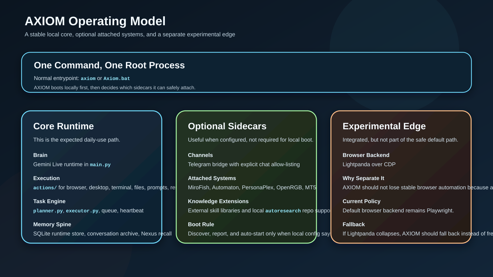
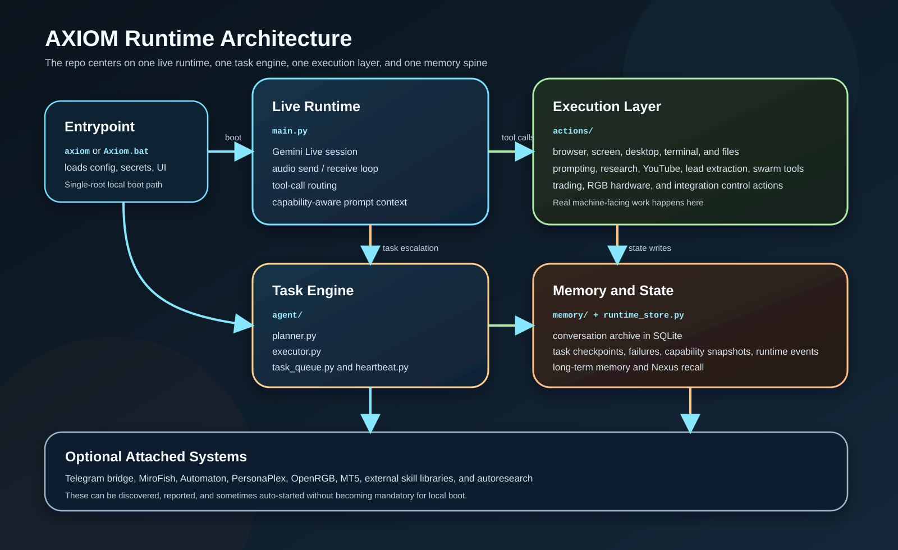

# A.X.I.O.M v4.3
### Windows-first live operator with real execution, persistent memory, and optional research sidecars

<p align="center">
  
</p>

<p align="center">
  <b>One local runtime, one command, real tool execution.</b><br>
  Gemini Live · Planner / Executor · Browser / Desktop / Terminal Control · Memory / SQLite State · Optional Telegram, MiroFish, Automaton, Lightpanda, and Autoresearch
</p>

<p align="center">
  
  
  
  
  
</p>

---

## What AXIOM Is

AXIOM is a local operator built around a Gemini Live voice runtime, a task engine, a real machine execution layer, and a persistent memory/state spine.

It is meant to boot as one root process and stay usable even when optional integrations are disabled.

Core ideas:

- `axiom` or `Axiom.bat` should be the normal local entrypoint.
- The live runtime, planner, executor, tools, and memory all belong to one connected system.
- Local state lives in SQLite and long-term memory files instead of vanishing with the last prompt.
- External systems like Telegram, MiroFish, Automaton, PersonaPlex, Lightpanda, and `autoresearch` are sidecars, not hard requirements for local boot.
- Public repo files stay portable; machine-specific paths and secrets belong in ignored local config files.

---

## Operating Model

<p align="center">
  
</p>

The repo is organized around a stable core path and controlled optional expansion. That matters because the project is doing real OS-level work and should not become fragile just because a sidecar repo or backend is missing.

---

## What Works Today

| Tier | Included | What to Expect |
|------|----------|----------------|
| Core runtime | Gemini Live, planner, executor, action routing, Playwright browser control, file/desktop/terminal tools, memory archive, runtime SQLite store, system context | This is the normal local boot path and the part AXIOM is built around |
| Optional integrations | Telegram bridge, MiroFish, Automaton, PersonaPlex, OpenRGB, MT5, external skill libraries, `autoresearch` | Enabled through local config; useful when present, but not required for `axiom` to start |
| Experimental path | Lightpanda browser backend | Wired into AXIOM and launchable, but Playwright remains the safe default backend |

Short version:

- If you only configure Gemini and Playwright, AXIOM should still boot and work locally.
- If you add sidecars, AXIOM can discover them, report status, and bring some of them online automatically.
- If a sidecar is missing, AXIOM should degrade instead of collapsing.

---

## Quick Start

```bash
git clone https://github.com/moyesrex-ops/Axiom.git
cd Axiom
pip install -r requirements.txt
python -m playwright install chromium
copy config\api_keys.example.json config\api_keys.json
```

Put your Gemini key into `config/api_keys.json`, then start AXIOM with:

```powershell
axiom
```

If `axiom` is not on your `PATH`, use:

```powershell
Axiom.bat
```

Public repo files:

- `config/api_keys.example.json` is the tracked template.
- `config/api_keys.json` is ignored by git.
- `config/runtime.json` is the tracked shared config.
- `config/runtime.local.json` is ignored by git and is the right place for machine-specific paths and local boot preferences.

---

## First Local Boot

The startup path is intentionally single-root:

1. You run `axiom` or `Axiom.bat`.
2. AXIOM loads tracked defaults from `config/runtime.json`.
3. AXIOM overlays `config/runtime.local.json` if it exists.
4. AXIOM checks secrets from `config/api_keys.json` or environment variables.
5. The UI can prompt for missing Gemini or optional Telegram setup on first run.
6. `boot_integrations()` attempts only the sidecars you explicitly enabled.
7. The Gemini Live runtime, planner/executor, action layer, and memory/state services come online as one connected system.

When local runtime updates are written later, AXIOM now prefers `config/runtime.local.json` so the tracked config can stay clean.

---

## Architecture

<p align="center">
  
</p>

The architecture is not "LLM plus random scripts". It has four real layers:

- `main.py` runs the live session and function-call routing.
- `agent/` handles multi-step planning, queueing, execution, and heartbeat.
- `actions/` is the machine execution layer for browser, desktop, terminal, files, prompts, research, trading, and system inspection.
- `memory/` and `core/` provide persistence, capability awareness, prompt context, runtime config, and external bridges.

That is the repo's actual mental model: one brain, one execution layer, one memory spine, optional sidecars.

---

## Startup, Memory, and Recall

<p align="center">
  
</p>

AXIOM no longer relies only on short prompt context.

It now persists:

- archived conversation turns
- runtime events and failures
- task lifecycle checkpoints
- structured long-term memory
- searchable Nexus knowledge

That gives the runtime an actual recall loop across sessions instead of pretending memory exists because the prompt says so.

---

## Live Recovery and Runtime Behavior

<p align="center">
  
</p>

The live layer is built around three practical concerns:

- better capture of softer or accented speech through adaptive gain behavior
- cleaner Telegram chat behavior instead of treating every message like a batch job
- reconnect recovery that restores recent context and logs runtime instability

---

## Repo Layout

```text
main.py                          Live Gemini runtime and tool dispatcher
ui.py                            Desktop HUD and first-run setup
actions/                         Real tool modules and external integration actions
agent/                           Planner, executor, queue, heartbeat
core/                            Prompt, config, capabilities, integration bridges
memory/                          Long-term memory and runtime SQLite state
assets/                          GitHub-facing diagrams and illustrations
config/runtime.json              Public non-secret runtime defaults
config/runtime.local.json        Local override file, ignored by git
config/api_keys.example.json     Public secret template
memory/axiom_state.db            Runtime state database, created locally
```

Important bridge modules:

- `core/integration_manager.py`
- `core/mirofish_bridge.py`
- `core/automaton_bridge.py`
- `core/lightpanda_bridge.py`
- `core/autoresearch_bridge.py`
- `core/skill_library.py`

---

## Runtime Config

Tracked shared config lives in `config/runtime.json`.

Important high-level keys:

```json
{
  "voice_name": "Charon",
  "voice_backend": "gemini_live",
  "live_model": "models/gemini-2.5-flash-native-audio-preview-12-2025",
  "channels": {
    "telegram": {
      "enabled": false,
      "allowed_chat_ids": [],
      "startup_prompt_enabled": true
    }
  },
  "integrations": {
    "mirofish_path": "",
    "mirofish_auto_start": false,
    "automaton_path": "",
    "automaton_state_dir": "",
    "automaton_auto_start": false
  },
  "browser": {
    "backend": "playwright",
    "lightpanda_endpoint": "http://127.0.0.1:9222",
    "lightpanda_auto_connect": false,
    "lightpanda_auto_start": false,
    "lightpanda_repo_path": "",
    "lightpanda_wsl_binary_path": ""
  },
  "skill_library": {
    "enabled": true,
    "everything_claude_code_path": "",
    "superpowers_path": "",
    "antigravity_skills_path": ""
  },
  "research_repos": {
    "autoresearch_path": ""
  },
  "system_context": {
    "enable_public_ip_lookup": false
  }
}
```

Example local override:

```json
{
  "integrations": {
    "mirofish_path": "C:\\Users\\you\\MiroFish",
    "mirofish_auto_start": true,
    "automaton_path": "C:\\Users\\you\\automaton_upstream",
    "automaton_state_dir": "C:\\Users\\you\\.automaton",
    "automaton_auto_start": true
  },
  "browser": {
    "lightpanda_endpoint": "http://127.0.0.1:9222",
    "lightpanda_repo_path": "C:\\Users\\you\\Axiom_research\\external\\lightpanda-browser",
    "lightpanda_wsl_binary_path": "/home/you/.local/bin/lightpanda"
  },
  "research_repos": {
    "autoresearch_path": "C:\\Users\\you\\Axiom_research\\external\\autoresearch"
  }
}
```

Behavioral notes:

- Telegram is optional.
- Public IP lookup is opt-in.
- Browser default stays on Playwright unless you explicitly opt into Lightpanda.
- Later runtime writes prefer `runtime.local.json` when it exists.

---

## Built-In Tooling

High-signal integrated tools:

- `system_capabilities` for live environment, failures, events, integrations, and context
- `nexus_memory` for save / recall / recent / search flows
- `skill_library` for searchable external workflow libraries
- `lightpanda_control` for inspecting and starting the optional Lightpanda backend
- `autoresearch_control` for repo readiness, dataset prep, baseline training, and results inspection
- `persona_control` for PersonaPlex inspection and setup
- `prompt_studio`, `lead_researcher`, and `swarm_orchestrator` for creative, research, and multi-role reasoning workflows

---

## External Integrations

### Telegram Bridge

Telegram is optional and can stay disabled without affecting local boot.

Setup:

1. Create a bot with [@BotFather](https://t.me/BotFather).
2. Add `telegram_bot_token` to `config/api_keys.json` or set `AXIOM_TELEGRAM_BOT_TOKEN`.
3. Enable `channels.telegram.enabled`.
4. Add explicit allowed chat IDs if you want remote execution, not just chat replies.

Design choice:

- ordinary chat should feel conversational
- queued task execution should stay permissioned
- empty allowed lists should not silently allow execution

### MiroFish and Automaton

AXIOM has dedicated bridge modules for both systems.

What that means:

- MiroFish can be discovered, queried, used as extra market context, and auto-started when configured correctly.
- Automaton can be discovered, built-status checked, memory-state inspected, and launch-attempted from AXIOM.

Use `integrations.mirofish_path`, `integrations.automaton_path`, and `integrations.automaton_state_dir` in local config if you want them attached to the runtime.

### Lightpanda

AXIOM understands Lightpanda as an optional browser backend.

Current stance:

- AXIOM can inspect repo state, endpoint readiness, and launch instructions.
- AXIOM can launch a WSL-installed Lightpanda binary when configured.
- AXIOM can connect over CDP when you opt into that backend.
- Playwright remains the safe default browser backend.

In other words, Lightpanda is integrated, but it is not treated as the primary stable browser path yet.

### External Skill Libraries

AXIOM can index local copies of:

- `everything-claude-code`
- `superpowers`
- `antigravity-awesome-skills`

Point the `skill_library.*_path` fields at those repos, or let AXIOM auto-detect them under a local external workspace.

### Autoresearch

AXIOM has a bridge for Karpathy's `autoresearch` repo so it can inspect more than just whether the repo exists.

It can report:

- whether `uv` is available
- whether a GPU is visible
- whether dataset shards and tokenizer artifacts exist
- whether `results.tsv` is present
- whether the local experiment loop has real outputs to inspect

### PersonaPlex, OpenRGB, and MT5

These stay optional, but AXIOM knows how to inspect and use them when they are present.

- PersonaPlex is a sidecar, not a replacement for the main Gemini Live runtime.
- OpenRGB remains the hardware RGB control path.
- MT5 remains the trading execution path with default SL/TP behavior and post-trade reflection support.

---

## Verification

Useful checks:

```powershell
python -m unittest discover -s tests -p "test_*.py" -v
python -m compileall .
python -c "from actions.system_capabilities import system_capabilities; print(system_capabilities({'action':'summary'}))"
```

Practical startup check:

```powershell
axiom
```

If `axiom` is not on your `PATH`, run:

```powershell
Axiom.bat
```

---

## Security and Local Files

- `config/api_keys.json` is ignored by git.
- `config/runtime.local.json` is ignored by git.
- `memory/axiom_state.db` is ignored by git.
- `config/api_keys.example.json` contains placeholders only.
- Public IP geolocation is off by default.
- The public repo is meant to carry portable defaults, not machine-specific secrets or absolute local paths.

---

## License

MIT

---

<p align="center">
  <b>A.X.I.O.M</b> - autonomy through execution
</p>
